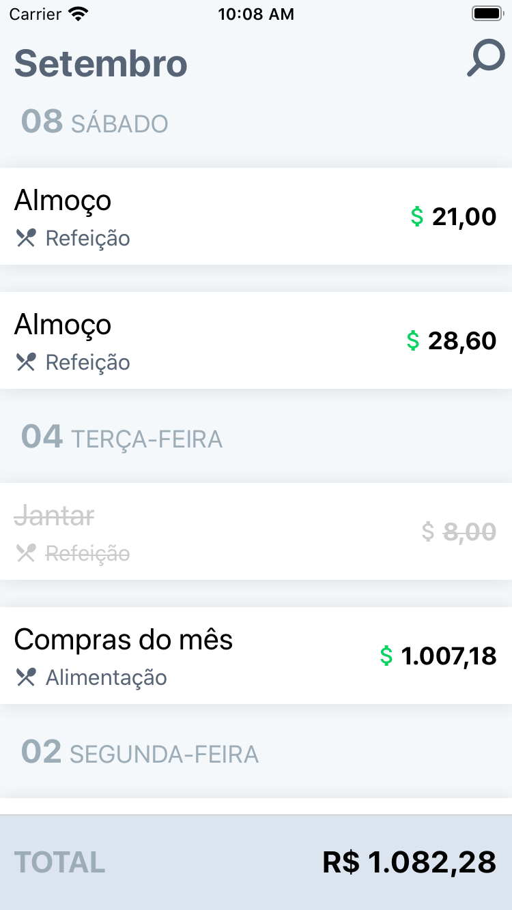
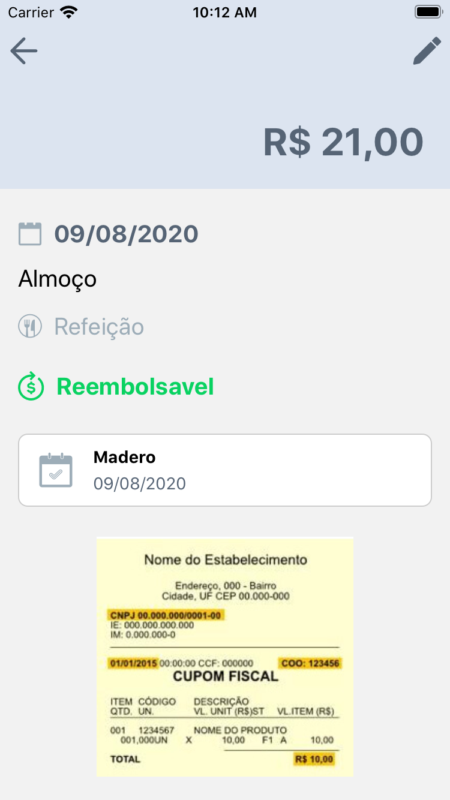

# Sobre a aplicação

Esse aplicativo é feito em react native, a proposta dele é para avalição da empresa contele.

# O que foi utilizado?

O aplicativo é bem simples, conta com uma lista de compras(refeições) separada por seções.

Para seguir o layout do figma proposto pela empresa utilizamos.

- react-native-vector-icons: criar ícones com base no layout
- icomoon: gerar fonte de ícones com os svgs fornecido
- react navigation: navegar entre a tela de listagem e detalhes do pedido usando stack navigation
- typescript
- expo

# Telas

  
  

